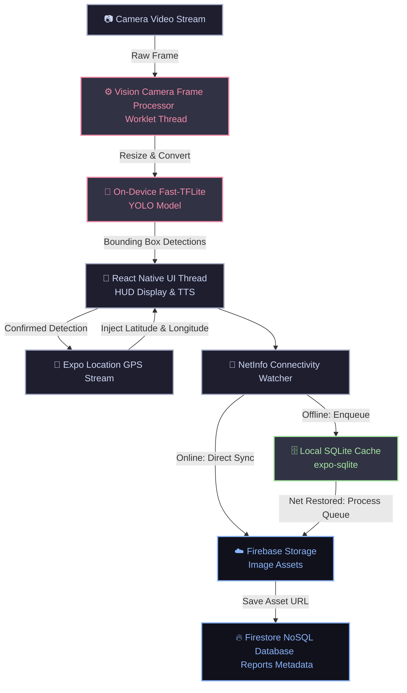

# 🛣️ LokAwaz (लोक आवाज़) — AI-Powered, Offline-First Road Inspector

> **"Voice of the People, Sentinel of the Roads."**  
> An advanced React Native / Expo mobile application that transforms any smartphone into an AI-powered road safety inspector. Utilizing real-time **Edge AI (on-device machine learning)**, it detects potholes on the fly, logs GPS-tagged hazard reports, and uses an **offline-first database sync pipeline** to guarantee reliable operation in remote areas with poor internet coverage.

---

## 🌟 Why LokAwaz? (For Recruiters & Tech Leads)

LokAwaz is not just a standard mobile CRUD app; it is a **highly-optimized, production-ready engineering showcase** that demonstrates proficiency in:
*   **Edge Machine Learning:** Running custom YOLO models (`.tflite`) on-device at **5 FPS** without locking the UI thread.
*   **Thread Isolation & Worklets:** Isolating frame processing via native worklets on specialized background threads.
*   **Robust Offline-First Architecture:** Engineering a reliable **SQLite queuing mechanism** with automatic network state listeners to bridge local and cloud syncing.
*   **Hardware and Sensor Integration:** Synchronizing high-performance GPS streams with camera shutter APIs.
*   **Premium & Tailored UX:** Designing a multi-theme environment featuring Stealth, High-Viz, and Cyber modes specifically suited to different driving conditions.

---

## 🏗️ System Architecture

LokAwaz separates high-throughput video streams and network actions from the main UI thread to ensure consistent 60 FPS user-interface performance.



---

## 🛠️ Tech Stack & Advanced Dependencies

*   **Framework:** React Native & Expo (SDK 54) with TypeScript.
*   **On-Device AI:** `react-native-fast-tflite` for hardware-accelerated model inference.
*   **Image Processing:** `vision-camera-resize-plugin` for sub-millisecond, low-level frame manipulation (RGB, float32 formatting).
*   **Threading Engine:** `react-native-worklets-core` for running background JS functions outside the React Native Javascript bridge.
*   **Local Caching:** `expo-sqlite` (using modernized, highly-performant asynchronous execution to prevent UI lockups during db contention).
*   **Network Sensing:** `@react-native-community/netinfo` for continuous connection status analysis.
*   **Backend Ecosystem:** **Firebase v12** (Authentication, Firestore NoSQL database, and Cloud Storage for photos).
*   **Sensor APIs:** `expo-location` for background-optimized GPS tracking, and `expo-speech` for hands-free audio announcements.
*   **Animation & UI:** `react-native-reanimated` for smooth, layout-driven interface responses.

---

## 💎 Features in Detail

### 1. AI Pothole Detection Dashcam (Edge AI)
By mounting the phone on the dashboard, the app runs continuous frame-by-frame pothole scanning using a custom-trained **YOLOv8-based model** (`pothole.tflite`).
*   **Adaptive Frame Throttling:** Runs detections strictly at 5 FPS to protect devices from overheating and severe battery drainage.
*   **High Confidence Threshold:** A 60% confidence baseline prevents false positives from lane markings or shadows.
*   **No-Sort Top-K Selector:** An $O(N)$ linear filter captures the top 5 highest-priority hazards without the performance cost of sorting arrays on every frame.

### 2. Dual-Sync Offline Pipeline (SQLite + Firebase)
Highways and rural areas often lack cellular coverage. LokAwaz handles this with a resilient sync pipeline:
*   **Local SQLite Cache:** If offline, image blobs are moved to local file storage, and GPS metadata is saved to SQLite.
*   **Auto-Resume Sync Daemon:** Once network recovery is detected by `@react-native-community/netinfo`, a background process is initiated that streams locally cached data to Firebase, freeing up device space.
*   **Database Lock-Safe Queries:** Utilizes modern `getAllAsync()` and `getFirstAsync()` SQLite transactions to completely bypass the lockups common in single-threaded SQLite wrappers.

### 3. Safety-First UX (Dynamic Themes & TTS)
*   **Hands-Free Audio Alerts:** Integrated Text-to-Speech (TTS) immediately announces *"Pothole detected"* so drivers can maintain their focus on the road.
*   **Theme Spectrum:**
    *   **Stealth (Default Dark):** Soft greys and deep blacks with high-contrast safety red accents, preventing eye fatigue during night driving.
    *   **High-Viz (Day Mode):** Optimized contrast and color schemes to guarantee screen readability in direct sunlight.
    *   **Cyber (HUD Mode):** A futuristic, cyberpunk theme using electric blue and hot pink colors that mimic professional vehicular telemetry displays.

---

## 📂 Project Structure

```
lokawazk/
├── assets/
│   ├── model/
│   │   └── pothole.tflite     # Custom YOLO neural network model
│   └── images/                # App icons and visual assets
├── src/
│   ├── Context/
│   │   └── Themecontext.tsx   # Context API for system-wide dynamic theme states
│   ├── Firebase/
│   │   └── FirebaseConfig.tsx # Auth, Storage, and Firestore integration APIs
│   ├── navigation/
│   │   └── AppNavigator.tsx   # Safe Area & Nested Routing structure (Tabs & Stack)
│   ├── screens/
│   │   ├── Home.tsx           # Multi-category launcher HUD
│   │   ├── Dashcam.tsx        # High-performance camera stream & bounding boxes overlay
│   │   ├── Mydetections.tsx   # Dynamic list showing Synced vs. Pending SQLite reports
│   │   ├── Nearby.tsx         # Geographic crowdsourced hazard visualization screen
│   │   ├── Profile.tsx        # Operator stats and user configurations
│   │   └── SignUp.tsx / Login.tsx # Robust secure Firebase-backed authorization screens
│   ├── services/
│   │   ├── Detection.ts       # Frame processing worklets, YOLO parser, and TTS speech queues
│   │   └── QueueService.ts    # SQLite initialization, sync pipelines, and local caching
│   └── themes/
│       └── themes.ts          # Styling tokens for Stealth, High-Viz, and Cyber modes
├── App.tsx                    # Top-level state and provider injection
├── app.json                   # Expo configuration file
└── package.json               # Package dependencies & npm scripts
```

---

## ⚡ Setup & Installation

Follow these steps to run the project locally in your development environment:

### Prerequisites
1.  **Node.js:** Ensure Node.js (v18+) is installed.
2.  **Expo CLI:** Make sure you have the Expo toolchain ready.
3.  **Android Studio / Xcode:** Required to build native code modules (like Vision Camera and Worklets).

### Step 1: Clone the Repository
```bash
git clone https://github.com/pratyansharana/LOKAWAZK-.git
cd LOKAWAZK-
```

### Step 2: Install Dependencies
```bash
npm install
```

### Step 3: Configure Firebase
Update [FirebaseConfig.tsx](file:///e:/LOKAWAZK-/src/Firebase/FirebaseConfig.tsx) with your unique Web App Firebase parameters.

### Step 4: Run Development Build
Since the application relies on low-level native modules (`react-native-vision-camera`, `react-native-fast-tflite`, etc.), you **cannot** run it in the standard Expo Go client. You must run a development build:

**For Android:**
```bash
npx expo run:android
```

**For iOS:**
```bash
npx expo run:ios
```

---

## 🧑‍💻 Code Quality Showcase

Here is a snippet from [Detection.ts](file:///e:/LOKAWAZK-/src/services/Detection.ts#L120-L157) demonstrating the performance-focused YOLO parser that runs within the isolated worklet context:

```typescript
// ✅ YOLO Parser running in a native background worklet
const parseYOLO = (output: any): Detection[] => {
  'worklet';

  const results = new Array();
  if (!output || !output[0]) return results;

  const flatArray = output[0];
  const totalElements = flatArray.length;

  const numAttributes = 5;
  const numPredictions = totalElements / numAttributes;

  const isNormalized = flatArray[2] <= 2.0;
  const scale = isNormalized ? 1 : MODEL_INPUT_SIZE;

  for (let i = 0; i < numPredictions; i++) {
    const confidence = flatArray[4 * numPredictions + i];

    // High confidence cutoff to minimize false detections
    if (confidence <= 0.6) continue; 

    const cx = flatArray[i];
    const cy = flatArray[numPredictions + i];
    const w = flatArray[2 * numPredictions + i];
    const h = flatArray[3 * numPredictions + i];

    results.push({
      x: (cx - w / 2) / scale,
      y: (cy - h / 2) / scale,
      w: w / scale,
      h: h / scale,
      score: confidence,
    });
  }

  return results;
};
```

---

## 📈 Future Roadmaps

1.  **On-Device Model Quantization:** Transition from Float32 weights to Int8 weights in the YOLO model to reduce memory footprint by 75%.
2.  **Crowdsourced Heatmaps:** Implement full interactive mapping in `Nearby.tsx` with heatmaps using crowdsourced geolocation data.
3.  **Active Suspension Telemetry:** Link into device accelerometer sensors to capture vertical G-force hits alongside the visual computer vision model reports.

---

### 📞 Contact & Portfolio
Created by **Pratyansh Rana**  
*   **GitHub:** [@pratyansharana](https://github.com/pratyansharana)  
*   **LinkedIn:** [@pratyansharana](https://www.linkedin.com/in/pratyansha-rana-99699b306/)
*   **Email:** pratyanshrana1@gmail.com

*Feel free to reach out for inquiries, mobile-engineering roles, or collaboration opportunities!*
